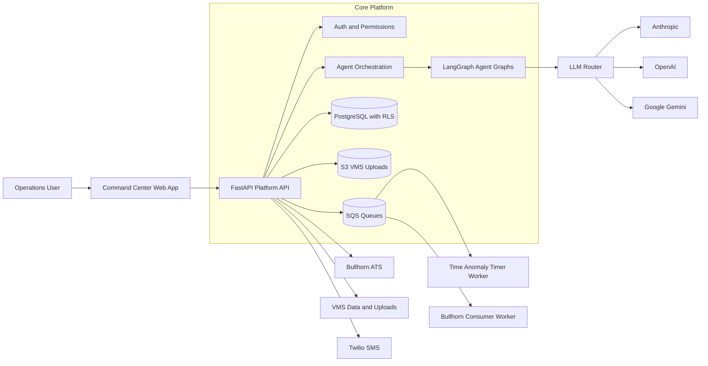
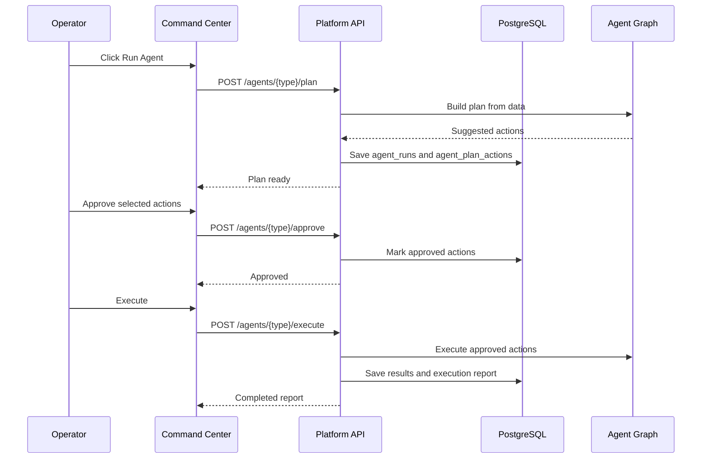
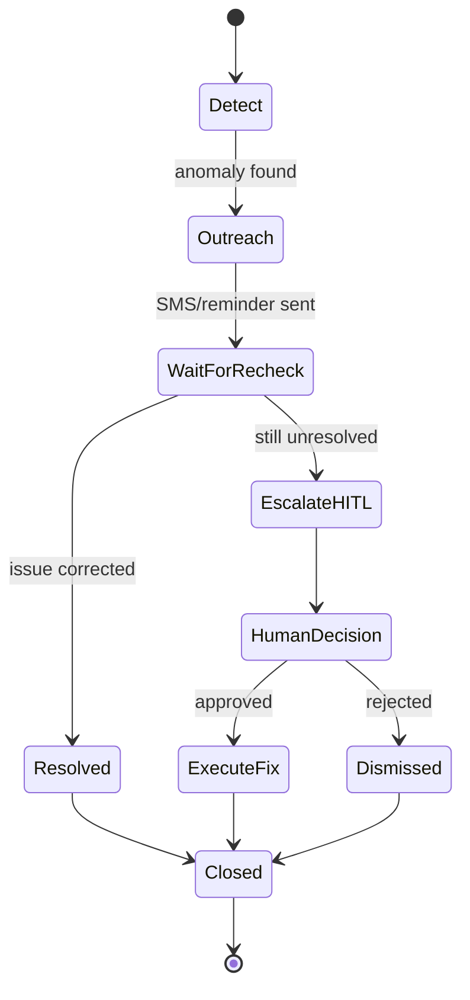
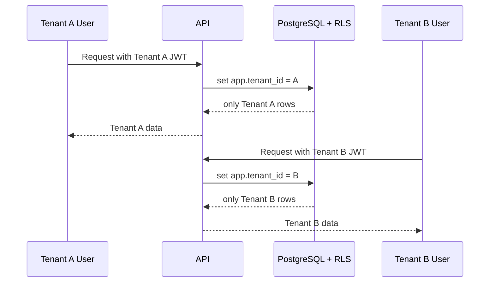
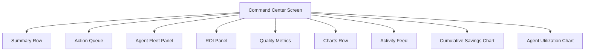
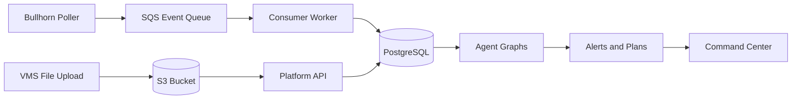

# StaffingAgent.ai - Architecture Diagrams (Deep Dive)

These diagrams mirror how the current codebase is organized and how the product behaves in production.

## 1) End-to-End System Map

## 2) Agent Plan-Approve-Execute Lifecycle

## 3) Time Anomaly Stateful Workflow

## 4) Tenant Security Boundary (RLS)

## 5) Command Center Component Layout

## 6) Data Ingestion and Processing

