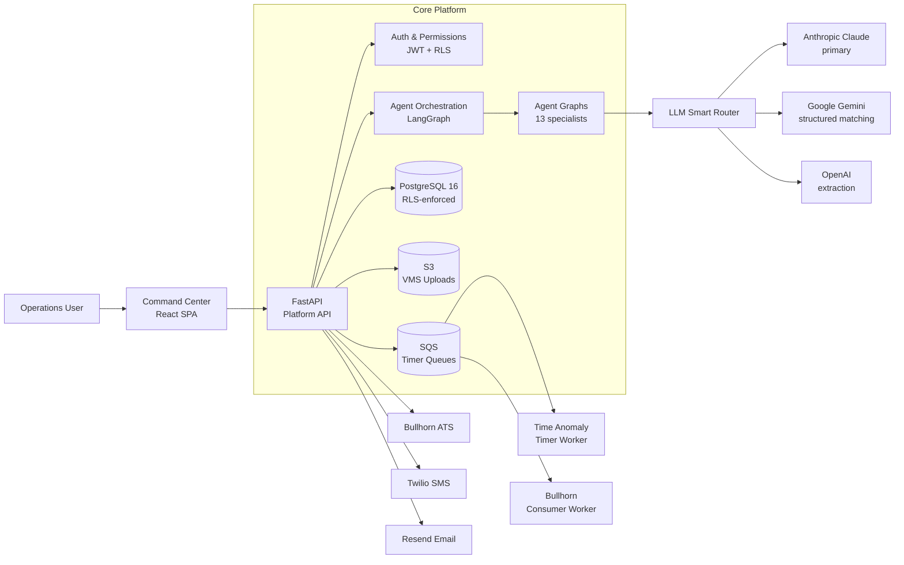
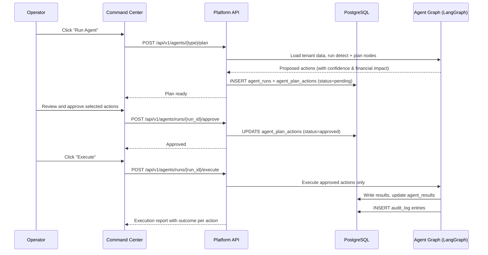
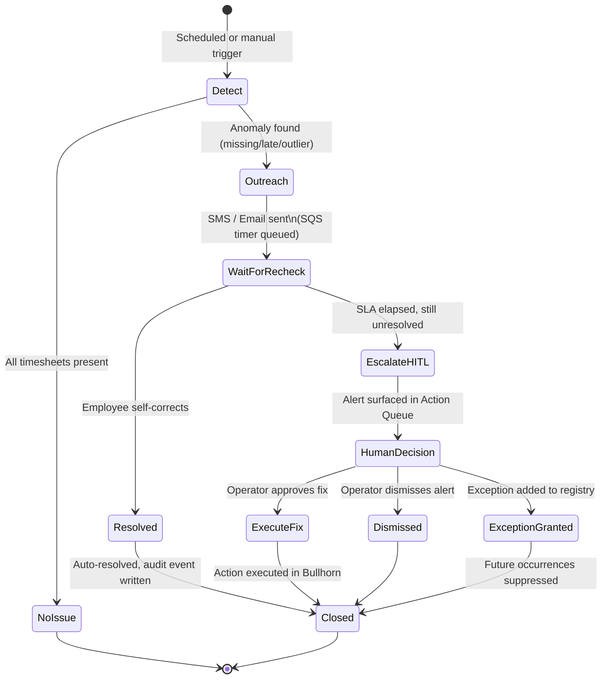
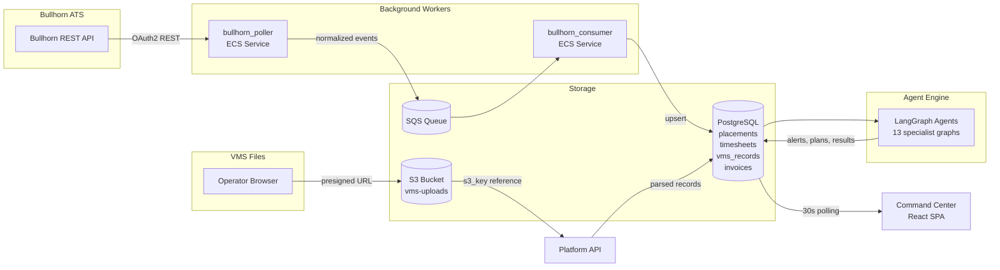
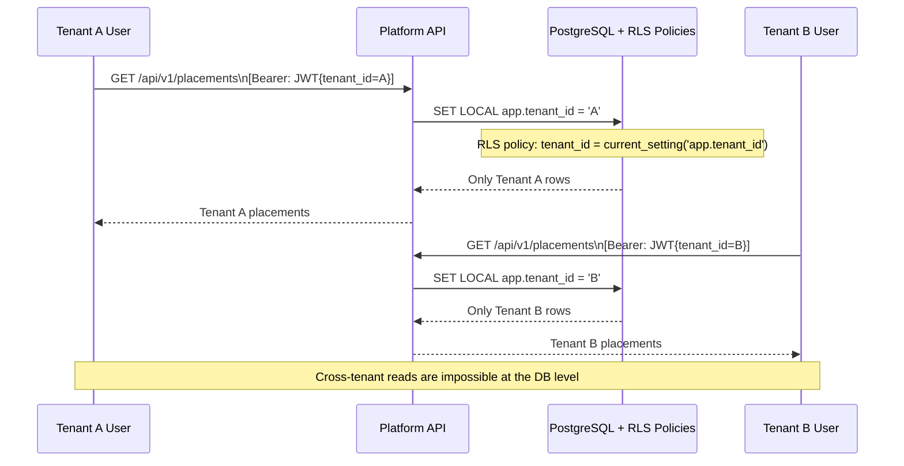
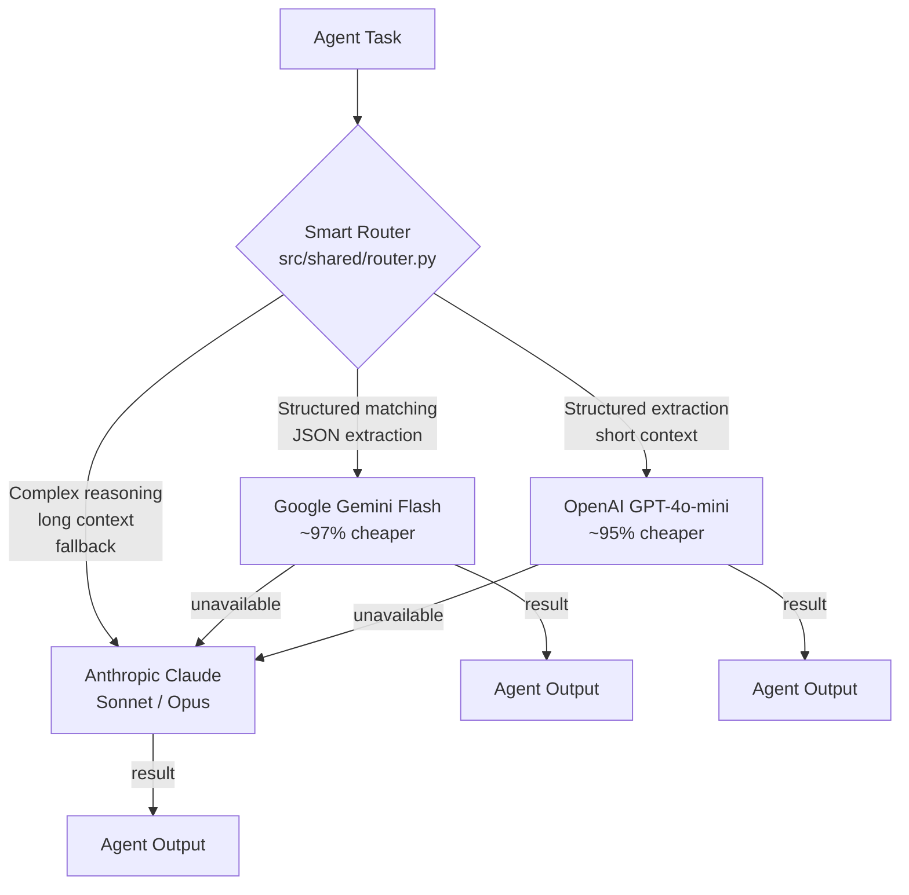
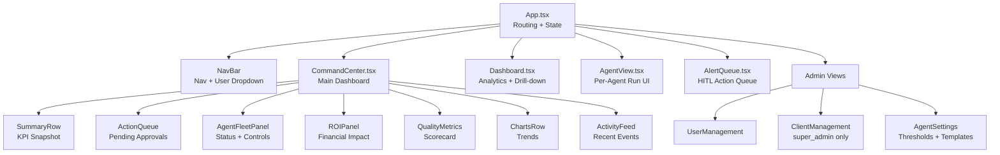
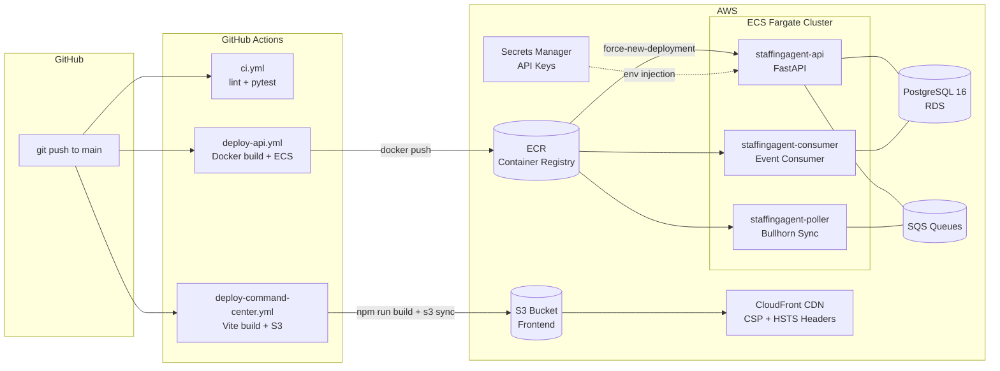
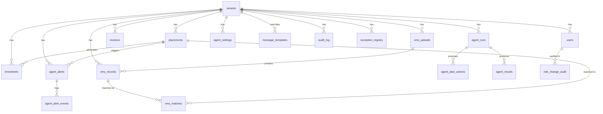

# StaffingAgent.ai

**AI-native operations control platform for staffing companies.**

StaffingAgent continuously monitors placements, timesheets, VMS records, payroll, billing, and invoices — then surfaces recommended actions to fix issues before they become revenue, compliance, or trust problems. A human stays in control: every significant action goes through an approval queue before execution.


---

## Table of Contents

1. [What Is StaffingAgent.ai](#1-what-is-staffingagentai)
2. [Architecture Overview](#2-architecture-overview)
3. [Tech Stack](#3-tech-stack)
4. [Agent Portfolio](#4-agent-portfolio)
5. [Key Flows & Diagrams](#5-key-flows--diagrams)
   - [Agent Plan → Approve → Execute Lifecycle](#51-agent-plan--approve--execute-lifecycle)
   - [Time Anomaly Stateful Workflow](#52-time-anomaly-stateful-workflow)
   - [Data Ingestion Pipeline](#53-data-ingestion-pipeline)
   - [Multi-Tenant Security Boundary (RLS)](#54-multi-tenant-security-boundary-rls)
   - [LLM Smart Router Flow](#55-llm-smart-router-flow)
   - [Command Center UI Component Tree](#56-command-center-ui-component-tree)
   - [Deployment Architecture](#57-deployment-architecture)
6. [Database Schema](#6-database-schema)
7. [Project Structure](#7-project-structure)
8. [Getting Started (Local Development)](#8-getting-started-local-development)
9. [Environment Variables](#9-environment-variables)
10. [CI/CD Pipeline](#10-cicd-pipeline)
11. [Security Model](#11-security-model)
12. [Testing](#12-testing)
13. [Contributing](#13-contributing)

---

## 1. What Is StaffingAgent.ai

Staffing agencies leak revenue and face compliance risk from three persistent sources:

| Problem | Impact |
|---|---|
| Missing or erroneous timesheets | Unbilled hours, payroll disputes |
| ATS ↔ VMS data mismatches | Invoice rejections, client trust damage |
| Slow collections on aging invoices | Cash flow pressure, write-offs |

StaffingAgent replaces manual spreadsheet audits with a fleet of specialized AI agents that run on a schedule, detect issues, propose a clear action plan, and wait for an operator to approve before executing anything irreversible.

**Key differentiators:**

- **Agent-based** — 13 specialist agents, each scoped to one domain (time, payroll, VMS, invoices, etc.)
- **Human-in-the-loop** — critical actions require approval; a 7-day undo window protects against mistakes
- **Multi-tenant safe** — PostgreSQL Row Level Security ensures strict client data isolation at the database level
- **Fully auditable** — every agent decision, approval, and state change is recorded in an immutable audit log

---

## 2. Architecture Overview



The system has three independent runtime services deployed on AWS ECS Fargate:

| Service | Role |
|---|---|
| `staffingagent-api` | HTTP API — handles all client requests, agent orchestration |
| `staffingagent-poller` | Background — polls Bullhorn ATS on a schedule, feeds SQS |
| `staffingagent-consumer` | Background — consumes SQS events, writes normalized data to PostgreSQL |

---

## 3. Tech Stack

| Layer | Technology | Notes |
|---|---|---|
| **Frontend** | React 19.2, TypeScript 5.9, Vite 8, React Router 7 | SPA deployed to S3 + CloudFront |
| **Backend** | Python 3.11, FastAPI 0.115, SQLAlchemy 2.0 async | 50+ REST endpoints |
| **Agent Engine** | LangGraph 0.2, Anthropic SDK 0.39 | One LangGraph graph per agent type |
| **Database** | PostgreSQL 16 + asyncpg | Row Level Security on all tenant tables |
| **Infrastructure** | AWS ECS Fargate, S3, SQS, CloudFront, ECR | Terraform IaC in `infra/` |
| **CI/CD** | GitHub Actions with OIDC auth to AWS | 6 workflows; no long-lived AWS keys |
| **ATS Integration** | Bullhorn REST API | OAuth2, polling + consumer pattern |
| **Outreach** | Twilio SMS, Resend Email | Per-tenant A2P 10DLC brand registration |
| **CRM** | HubSpot | Lead capture and pipeline |
| **LLM Providers** | Anthropic (required), Google Gemini (optional), OpenAI (optional) | Smart router auto-selects |
| **Encryption** | Fernet (symmetric), bcrypt (passwords), JWT HS256 | Bullhorn creds encrypted at rest |

---

## 4. Agent Portfolio

| Agent | Phase | Status | What It Does |
|---|---|---|---|
| **Time Anomaly** | P0 | Active | Detects missing, late, or unusual timesheet hours; auto-outreaches via SMS, escalates to HITL |
| **Risk Alert** | P0 | Active | Rule-based checks for duplicate timesheets, rate anomalies, markup violations |
| **Invoice Matching** | P0 | Active | Compares billable charges to invoice line items, surfaces aging exceptions |
| **Collections** | P0 | Active | Prioritizes overdue invoices, suggests and sends collection communications |
| **Compliance** | P1 | Active | Surfaces contract violations and recommends remediation steps |
| **VMS Reconciliation** | P2 | Active | Flags discrepancies between ATS (Bullhorn) and VMS data |
| **VMS Matching** | P2 | Active | Fast fuzzy + alias + LLM matching to link VMS records to Bullhorn placements |
| **GL Reconciliation** | P3 | Beta | Aligns finance activity with General Ledger expectations |
| **Payroll Reconciliation** | P3 | Beta | Validates payroll outcomes against payable logic |
| **Forecasting** | P3 | Beta | Projects staffing, revenue, and utilization trends |
| **KPI Monitor** | P3 | Beta | Summarizes agency performance metrics |
| **Commissions** | P3 | Beta | Validates commission calculations |
| **Contract Compliance** | P3 | Beta | Checks assignments against SOW and contract boundaries |

All agents follow the same 5-step operating pattern:

```
Detect → Plan → Approve → Execute → Report
```

---

## 5. Key Flows & Diagrams

### 5.1 Agent Plan → Approve → Execute Lifecycle

Every significant action follows this human-controlled lifecycle. No write operations reach Bullhorn or the database without an operator explicitly approving the plan.



### 5.2 Time Anomaly Stateful Workflow

The Time Anomaly agent is the most complex: it uses SQS-based timers to schedule rechecks and supports automatic resolution if the employee corrects the issue before a human needs to intervene.



**Alert severity groups:**

| Group | Condition | Auto-Outreach | HITL Escalation |
|---|---|---|---|
| A | Timesheet missing for pay period | Yes (SMS) | Yes, after SLA |
| B | Hours over expected limit | Yes (SMS) | Yes, after SLA |
| C | Hours variance from baseline | No | Yes, immediately |

### 5.3 Data Ingestion Pipeline

Data flows from two external sources into PostgreSQL, then feeds every agent's detect phase.



### 5.4 Multi-Tenant Security Boundary (RLS)

Every database query is automatically scoped to a single tenant's data. Even a query without a `WHERE tenant_id = ?` clause cannot read another tenant's rows.



### 5.5 LLM Smart Router Flow

The Smart Router selects the cheapest capable provider for each task. Anthropic Claude is always the fallback. Providers are skipped if their API key is absent.



### 5.6 Command Center UI Component Tree

The Command Center dashboard is the primary operator interface. It refreshes on a 30-second polling interval.



### 5.7 Deployment Architecture



---

## 6. Database Schema

51 SQL migrations define the schema. Major entity groups and their relationships:



**Core tables at a glance:**

| Table | Purpose |
|---|---|
| `tenants` | Staffing agency clients; holds Bullhorn creds (encrypted), tier, Twilio config |
| `users` | Platform users with role (`viewer` / `manager` / `admin` / `super_admin`) and JSONB permissions |
| `placements` | Staff assignments synced from Bullhorn (candidate, client, rates, dates) |
| `timesheets` | Time records synced from Bullhorn (hours, rates, pay period) |
| `vms_records` | Parsed VMS file records (hours, rates, PO number) |
| `invoices` | Invoice records synced from Bullhorn (amount, aging, status) |
| `agent_runs` | Lifecycle record for each agent execution (status, plan, result, token usage) |
| `agent_plan_actions` | Individual proposed actions within a run (approve/reject/skip per action) |
| `agent_results` | Detailed output per record inspected by an agent |
| `agent_alerts` | HITL alerts with severity, state, and resolution type |
| `agent_alert_events` | Append-only event log for alert state transitions |
| `exception_registry` | Scoped suppressions to silence recurring false positives |
| `vms_matches` | Match decisions linking VMS records to Bullhorn placements |
| `vms_name_aliases` | Learned name aliases from confirmed matches |
| `message_templates` | Jinja2 SMS/email templates (tenant-overridable) |
| `audit_log` | Immutable record of every agent action with human approval context |

---

## 7. Project Structure

```
StaffingAgent-main/
├── app_platform/           # FastAPI backend application
│   ├── api/                # Endpoints, ORM models, auth, database
│   └── workers/            # Background worker entry points
│
├── command-center-app/     # React + TypeScript frontend (Vite)
│   └── src/
│       ├── api/            # API client with auth + silent refresh
│       ├── auth/           # AuthContext (JWT, login, logout)
│       ├── components/     # 24+ React components (dashboard, agents, admin)
│       ├── context/        # UIContext (dark/light theme)
│       └── types/          # Shared TypeScript interfaces
│
├── src/                    # Core agent and integration logic
│   ├── agents/             # 13 LangGraph agent implementations
│   │   └── {name}/         #   graph.py, nodes.py, detectors.py, state.py, config.py
│   ├── shared/             # LLM router, base graph, state models, audit utilities
│   ├── sync/               # Bullhorn OAuth2, polling, and consumer
│   ├── integrations/       # HubSpot, Twilio SMS
│   ├── advisory/           # CEO daily brief, weekly report, email delivery
│   └── marketing/          # Content generation and persona handling
│
├── deploy/                 # Container and infrastructure config
│   ├── db/                 # PostgreSQL migrations (051 files, Alembic)
│   ├── Dockerfile          # Python 3.11 slim, non-root user
│   ├── docker-compose.yml  # Local dev: Postgres + LocalStack + API
│   └── task-def.json       # AWS ECS task definition
│
├── infra/                  # Terraform IaC for AWS (ECS, RDS, CloudFront, ECR)
├── config/                 # RBAC permissions config, tenant setup helpers
├── prompts/                # LLM prompt templates (sales/support chat)
├── scripts/                # Utility scripts (migration, validation, screenshots)
├── site/                   # Marketing website (HTML/CSS/JS)
├── tests/                  # Test suite (unit, integration, security)
├── .env.example            # All environment variables documented
└── .github/workflows/      # 6 GitHub Actions CI/CD workflows
```

---

## 8. Getting Started (Local Development)

**Prerequisites:** Docker, Docker Compose, Python 3.11+, Node 20+

```bash
# 1. Clone the repo
git clone https://github.com/StaffingAgent-ai/StaffingAgent.git
cd StaffingAgent-main

# 2. Configure environment
cp .env.example .env
# Edit .env — minimum required:
#   ANTHROPIC_API_KEY=sk-ant-...
#   JWT_SECRET=$(openssl rand -base64 48)
#   BULLHORN_CREDS_KEK=$(python -c "from cryptography.fernet import Fernet; print(Fernet.generate_key().decode())")

# 3. Start local infrastructure (Postgres + LocalStack S3)
docker compose -f deploy/docker-compose.yml up -d

# 4. Run database migrations
python deploy/db/migrate.py

# 5. Start the backend API
uvicorn app_platform.api.main:app --reload --port 8000

# 6. In a new terminal, start the frontend
cd command-center-app
npm install
npm run dev
# Opens at http://localhost:5173
```

**Health check:** `GET http://localhost:8000/health`

---

## 9. Environment Variables

All variables are documented in [`.env.example`](.env.example). Here's a summary by category:

### LLM Providers

| Variable | Required | Purpose |
|---|---|---|
| `ANTHROPIC_API_KEY` | **Yes** | Primary LLM provider (universal fallback) |
| `GOOGLE_AI_API_KEY` | No | Enables Gemini Flash for structured matching (97% cheaper) |
| `OPENAI_API_KEY` | No | Enables GPT-4o-mini for structured extraction (95% cheaper) |

### Security & Auth

| Variable | Required | Purpose |
|---|---|---|
| `JWT_SECRET` | **Yes** | HS256 signing secret — minimum 32 characters |
| `BULLHORN_CREDS_KEK` | **Yes** | Fernet key for encrypting Bullhorn credentials at rest |
| `BULLHORN_CREDS_KEK_PREVIOUS` | No | Previous key for zero-downtime rotation |

### ATS Integration (Bullhorn)

| Variable | Required | Purpose |
|---|---|---|
| `BULLHORN_REST_URL` | No* | Bullhorn REST API base URL |
| `BULLHORN_CLIENT_ID` | No* | OAuth2 client ID |
| `BULLHORN_CLIENT_SECRET` | No* | OAuth2 client secret |
| `BULLHORN_TOKEN_URL` | No* | OAuth2 token endpoint |

*Required for Bullhorn sync to function.

### Outreach & Notifications

| Variable | Required | Purpose |
|---|---|---|
| `TWILIO_ACCOUNT_SID` | No | SMS outreach for Time Anomaly agent |
| `TWILIO_AUTH_TOKEN` | No | Twilio auth |
| `RESEND_API_KEY` | No | Email delivery for CEO daily brief |
| `HUBSPOT_ACCESS_TOKEN` | No | CRM lead capture |

### Optional Integrations

| Variable | Purpose |
|---|---|
| `NOTION_API_KEY` | CEO task board and daily brief archive |
| `NBRAIN_API_URL` + `NBRAIN_API_KEY` | Knowledge base queries |

### Logging

| Variable | Default | Purpose |
|---|---|---|
| `LOG_LEVEL` | `INFO` | `DEBUG`, `INFO`, `WARNING`, `ERROR` |

---

## 10. CI/CD Pipeline

Six GitHub Actions workflows manage the full delivery pipeline:

| Workflow | Trigger | What It Does |
|---|---|---|
| `ci.yml` | Push/PR to `main` | Linting (`ruff`) + full `pytest` test suite |
| `deploy-api.yml` | Push to `main` (backend files changed) | Docker build → push to ECR → ECS force-deploy (all 3 services) |
| `deploy-command-center.yml` | Push to `main` (`command-center-app/**` changed) | `npm run build` → S3 sync with cache headers → CloudFront invalidation |
| `deploy-site.yml` | Push to `main` (site files changed) | Deploy marketing site |
| `daily-ceo-brief.yml` | Daily schedule | Generate and email CEO daily operational brief |
| `weekly-advisory.yml` | Weekly schedule | Generate and distribute weekly advisory report |

All workflows authenticate to AWS using OIDC (no long-lived AWS credentials stored in GitHub Secrets).

---

## 11. Security Model

### Authentication
- **JWT HS256** tokens with 60-minute expiry
- Silent token refresh within a 7-day window (no re-login required)
- Bcrypt password hashing with per-user salt

### Authorization
- Four-tier role hierarchy: `viewer` → `manager` → `admin` → `super_admin`
- Fine-grained JSONB permissions field for custom access grants
- Every role escalation is recorded in `role_change_audit`

### Data Isolation
- **PostgreSQL Row Level Security (RLS)** on all tenant-scoped tables
- Every request sets `SET LOCAL app.tenant_id = '<uuid>'` in the DB session
- RLS policies enforce: `tenant_id = current_setting('app.tenant_id')`
- Cross-tenant reads are impossible even without explicit `WHERE` clauses

### Credential Protection
- Bullhorn API credentials are encrypted with **Fernet symmetric encryption** before storage
- Encryption key lives in AWS Secrets Manager, injected at ECS task startup
- Key rotation supported via `BULLHORN_CREDS_KEK_PREVIOUS` (dual-decrypt during rotation)

### Web Security Headers (CloudFront)
- `Content-Security-Policy` — restricts scripts, connections to known origins
- `Strict-Transport-Security` (HSTS) — forces HTTPS
- `X-Frame-Options: DENY` — prevents clickjacking
- `Cross-Origin-Embedder-Policy` (COEP)
- `Referrer-Policy: strict-origin-when-cross-origin`

### Reversible Actions
- Agent-executed changes have a **7-day undo window** via `POST /api/v1/alerts/{id}/reverse`
- Protects against incorrect auto-resolutions (e.g., a timesheet wrongly marked DNW)

---

## 12. Testing

```bash
# Run the full test suite
pytest tests/

# Run a specific category
pytest tests/test_time_anomaly_detectors.py
pytest tests/security/
pytest tests/integration/
```

**Test categories:**

| Category | Files | Coverage |
|---|---|---|
| Time Anomaly | `test_time_anomaly_*.py` | Detection logic, benchmarks, SLA timers, config |
| Risk Alerts | `test_risk_alert_detectors.py` | All rule-based detectors |
| Agent Core | `test_core_agent_detectors.py` | Shared detector utilities |
| Alerts API | `test_alerts_api.py` | Alert CRUD, lifecycle, resolve/reverse |
| Gateway | `test_gateway_*.py` | Bullhorn write operations |
| Templates | `test_message_templates.py` | SMS/email template rendering |
| SMS Outreach | `test_twilio_sms.py` | Twilio integration |
| Security | `tests/security/` | Auth, RLS, injection checks |
| Integration | `tests/integration/` | End-to-end flows |

---

## 13. Contributing

1. **Branch** off `main`: `git checkout -b feat/your-feature`
2. **Code style**:
   - Python: `ruff check .` and `ruff format .`
   - TypeScript: `npm run lint` (ESLint 9)
3. **Tests**: add or update tests for any changed behavior; `pytest` must pass
4. **PR**: open a pull request against `main`; CI will run lint + tests automatically
5. **Agents**: each new agent lives in `src/agents/{name}/` with the standard 5-file structure (`graph.py`, `nodes.py`, `detectors.py`, `state.py`, `config.py`)

For bugs or feature requests, please [open an issue](https://github.com/StaffingAgent-ai/StaffingAgent/issues).

---

> **Additional docs:** [`ARCHITECTURE_NEW.md`](ARCHITECTURE_NEW.md) · [`ARCHITECTURE_DIAGRAMS.md`](ARCHITECTURE_DIAGRAMS.md) · [`PRODUCT_GUIDE.md`](PRODUCT_GUIDE.md)
